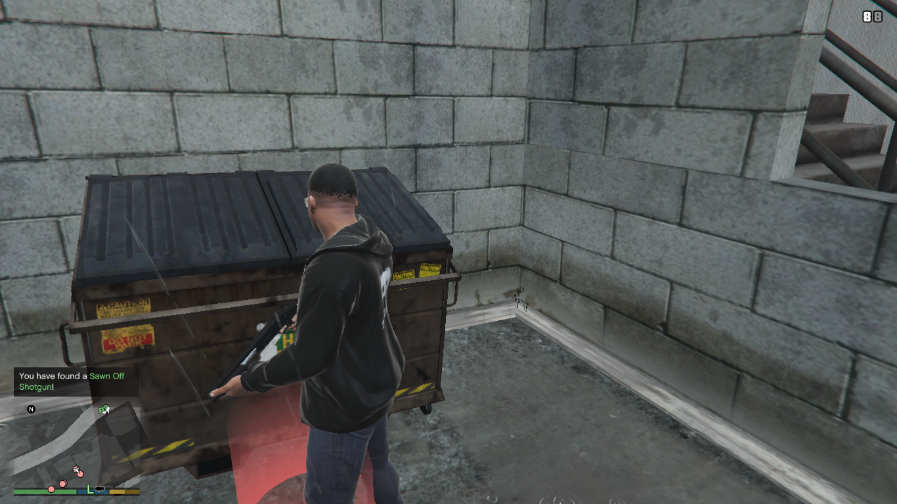

# DumpsterDiving [![5mods][5mods-img]][5mods-url] [![AppVeyor][appveyor-img]][appveyor-url] [![CodeFactor][codefactor-img]][codefactor-url] [![Discord][discord-img]][discord-url]

DumpsterDiving is a mod for Grand Theft Auto V that implements the Dumpster Diving/Looting from Grand Theft Auto: Chinatown Wars.

    

# Installation

[.NET Framework 4.8](https://dotnet.microsoft.com/download/dotnet-framework/net48) is required.

1. Download the compressed file from [GitHub Releases][releases-url] or [5mods][5mods-url]
2. Extract the files inside of the 7zip into your `scripts` folder

# Usage

1. Find a Dumpster in the game map
2. Go to the marker that appeared on the front of the Dumpster
3. Press E to Loot that Dumpster

[5mods-img]: https://img.shields.io/badge/5mods-download-20BA4E.svg
[5mods-url]: https://www.gta5-mods.com/scripts/dumpsterdiving
[appveyor-img]: https://img.shields.io/appveyor/ci/justalemon/dumpsterdiving.svg?label=appveyor
[appveyor-url]: https://ci.appveyor.com/project/justalemon/dumpsterdiving
[codefactor-img]: https://www.codefactor.io/repository/github/justalemon/dumpsterdiving/badge
[codefactor-url]: https://www.codefactor.io/repository/github/justalemon/dumpsterdiving
[discord-img]: https://img.shields.io/badge/discord-join-7289DA.svg
[discord-url]: https://discord.gg/Cf6sspj
[releases-url]: https://github.com/justalemon/DumpsterDiving/releases
